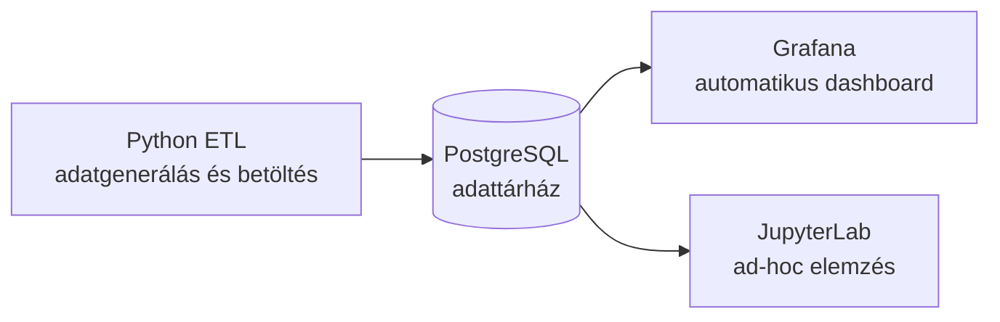

# Retail Data Platform

Konténerizált, integrált data engineering demórendszer egy kiskereskedelmi vállalat
értékesítési adatainak gyűjtésére, tárolására, elemzésére és vizualizálására.

## Architektúra



| Szolgáltatás | Szerep | Elérés |
|---|---|---|
| PostgreSQL 16 | Perzisztens adattárolás, nézetek és indexek | `localhost:5432` |
| Python ETL | Historikus seed és folyamatos rendelésbetöltés | háttérszolgáltatás |
| Grafana 11 | Automatikusan provisionált vezetői dashboard | `http://localhost:3000` |
| JupyterLab | Interaktív adatelemzés előkészített notebookkal | `http://localhost:8888` |

## Indítás

Előfeltétel: Docker Engine és Docker Compose plugin.

```bash
docker compose up --build
```

Az első induláskor az ETL 350 historikus rendelést tölt be, majd 10 másodpercenként
új adatokat generál. A Grafana dashboard és a PostgreSQL adatforrás kézi
konfiguráció nélkül létrejön.

Megnyitás:

- Grafana dashboard: `http://localhost:3000/d/retail-overview`
- Grafana admin belépés: `admin` / `admin`
- JupyterLab: `http://localhost:8888`, token nélkül
- Notebook: `notebooks/business_analysis.ipynb`

Leállítás:

```bash
docker compose down
```

Leállítás és az összes generált adat törlése:

```bash
docker compose down -v
```

## Szolgáltatások integrációja

A szolgáltatások a `data-platform` nevű belső Docker bridge hálózaton kommunikálnak.
A konténerek DNS-névként a szolgáltatásneveket használják, ezért nincs szükség fix
IP-címekre. Az ETL, a Grafana és a Jupyter csak a PostgreSQL healthcheck sikeres
lefutása után indul el. A PostgreSQL és Grafana named volume-okkal őrzi meg az
adatokat újraindítás után.

## AWS EC2 futtatás

Részletes lépések: [AWS_SETUP.md](AWS_SETUP.md).

Röviden: hozz létre egy Ubuntu EC2 példányt, telepítsd rá a Dockert, töltsd fel vagy
klónozd a repository-t, majd futtasd a projekt mappájában:

```bash
docker compose up --build -d
```

Biztonsági megjegyzés: a demóban szereplő jelszavak és token nélküli Jupyter kizárólag
kurzusprojekthez valók. Éles rendszerben AWS Secrets Manager, TLS, privát alhálózat,
hitelesítés és szűk security group szabályok szükségesek.

## Ellenőrzés és hibakeresés

```bash
docker compose ps
docker compose logs -f etl
docker compose exec postgres psql -U retail_user -d retail -c "SELECT COUNT(*) FROM orders;"
```

## Továbbfejlesztési lehetőségek

- Apache Kafka a nagy terhelésű eseményfolyam pufferelésére
- Apache Airflow ütemezett adatminőségi és aggregációs feladatokhoz
- S3 alapú data lake és Parquet archívum
- dbt transzformációk és automatikus tesztek
- Prometheus infrastruktúra-monitorozás
